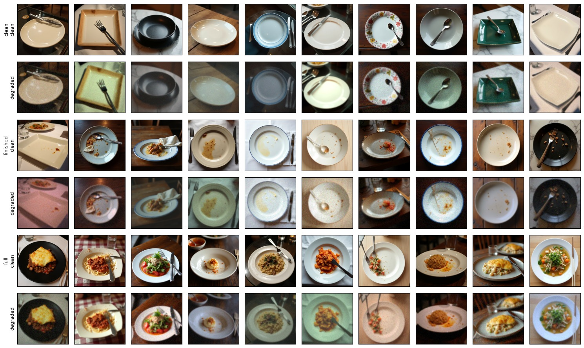
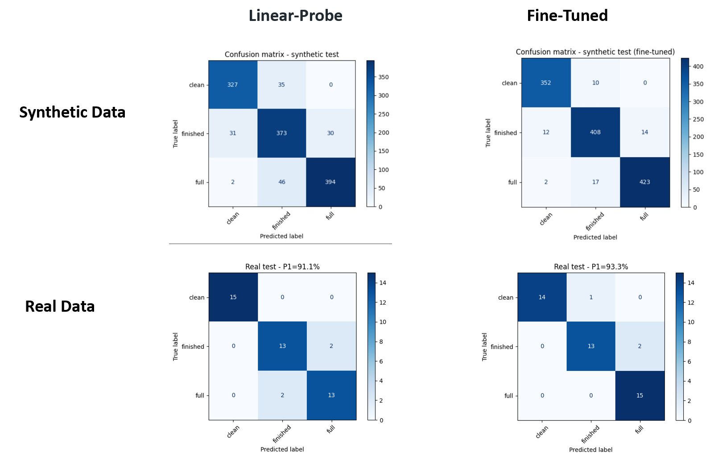
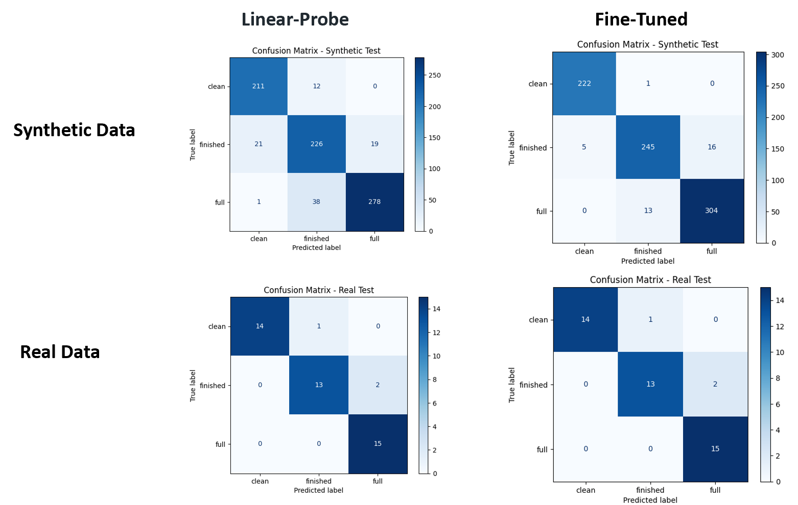

# Food Consumption Level Classification

**Authors:** Shlomi Ben Shitrit, Yarden Aviad, Avital Skop

---

## Description

In real-world restaurant environments, understanding the state of a plate (clean, finished, or full) can support automation and improve service efficiency.

However, real-world images are highly variable due to lighting, camera quality, noise, and perspective. Models trained on clean or synthetic data often fail when deployed in real conditions due to the **synthetic-to-real domain gap**.

This project investigates whether **synthetic data generation and camera-based augmentations** can improve robustness and generalization to real-world images.

---

## Problem Definition

**Input:** Plate image (clean or degraded)  
**Output:** Consumption state classification (Clean / Finished / Full)

**Goal:** Enable automated monitoring of table states in restaurant environments.

---

## Approach

We propose a pipeline combining synthetic data generation with realistic augmentations:

1. Generate synthetic plate images using FLUX.1-dev  
2. Apply camera-based augmentations to simulate real-world conditions  
3. Train CNN models on synthetic data  
4. Evaluate on both synthetic and real-world images  

---

## Synthetic Data Generation

Synthetic images were generated using **FLUX.1-dev** with structured prompt engineering.

- Attribute-based prompt generation  
- High diversity (≈300 prompts per class)  
- Fully reproducible using fixed seeds  

Classes:
- Clean (empty pristine plate)
- Finished (used plate with residue)
- Full (plate with food)

  

---

## Augmentation Strategy – Camera Simulation

To bridge the synthetic-to-real gap, we simulate real camera conditions:

- Low resolution (downscaling)
- Gaussian blur (defocus)
- Sensor noise
- Brightness & contrast variations
- Camera tilt & perspective shift
- Color cast (white balance changes)
- Vignette effects
- JPEG compression artifacts

These augmentations approximate the **full image formation process of real cameras**.

---

## Models

We evaluate multiple models:

### ResNet-based Models
- ResNet18 (Linear Probe + Fine-Tuning)
- ResNet50 (Linear Probe + Fine-Tuning)

### CLIP (Baseline)
- Zero-shot classification using text prompts

---

## Pipeline

Pipeline steps:

- Synthetic data generation  
- Augmentation  
- Train / validation / test split  
- Model training (LP / FT)  
- Evaluation on synthetic and real data  

---

## Results

### ResNet18

  

### ResNet50

  

---

## Model Comparison

| Model         | Synthetic Acc | Real Acc |
|---------------|-------------  |----------|
| ResNet18 (LP) | 88%           | 91%      |
| ResNet18 (FT) | 96%           | 93%      |
| ResNet50 (LP) | 88%           | 93%      |
| ResNet50 (FT) | 95%           | 94%      |

---

## Key Insights

- A clear **synthetic → real domain gap** exists  
- Augmentations significantly improve generalization  
- Fine-tuning outperforms linear probe  
- Even a small amount of real data helps bridge the gap  
- Larger models (ResNet50) do not always outperform when data is limited  

---

## Limitations

- Very small real-world dataset (~30 images)  
- Synthetic data does not fully capture real-world variability  

---

## Future Work

### System-Level
- Plate state tracking over time  
- Waiter decision support system  
- Multi-table scene understanding  

### Machine Learning
- Improve augmentation realism  
- Combine models (CLIP + CNN)  
- Explore self-supervised methods (e.g., DINO)  

---

## Dataset

Synthetic dataset and real test samples are available here:

👉 [Google Drive Dataset Link](https://drive.google.com/drive/folders/1o3WT-SvScKymGHlqgD4HQbeh3ETCTYWf)

---

## Project Structure
